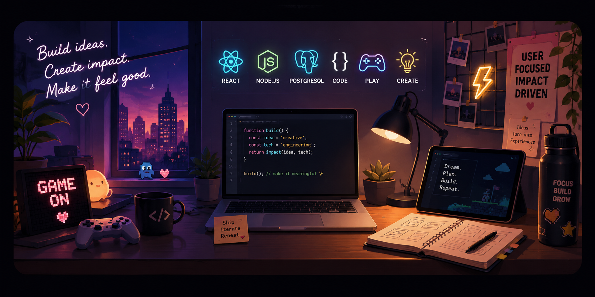

  

# Hi, I'm Tatiana, Welcome! 
## Software Engineer | Full-Stack Developer

I build interactive, user-centered software where engineering meets creativity and product experience.

I'm especially interested in building applications that don't just work well — they feel good to use.

Interested in: Full-Stack Engineering · Product Engineering · AI · Developer Tools · Interactive Experiences

## Featured Projects

🎮 Jolt
A full-stack game platform designed around fast, replayable
games and a polished game-night experience.

`React` · `TypeScript` · `Node.js` · `Express` · `PostgreSQL`
Live Demo · GitHub

🧠 Kinnect

A care-focused application designed to help older adults identify and respond to potential scams, combining accessible UX with AI-powered tools.

`React` · `Node.js` · `Gemini API` · `Speech-to-Text`
[Live Demo](https://care-infrastructure.onrender.com/) · [GitHub](https://github.com/project-jwt/care-infrastructure)

✅ TaskFlow 
A full-stack task management application built to explore real-world application architecture, authentication, APIs, and database design.

`React` · `Vite` · `Express` · `PostgreSQL`
[Live Demo](https://taskflow-onrender-com.onrender.com/auth) · GitHub

## ⚡ Skills

**Languages**

  
  
  
  

**Frontend**

  
  
  
  
  

**Backend & Data**

  
  
  
  

**Tools**

  
  

## What I'm Interested In

Full-Stack & Product Engineering
Backend Architecture & Developer Tools
AI-powered Applications
Interactive & Game Experiences
User-Centered Technology
Building products from idea → implementation

## Currently

Building → Jolt and exploring what makes software genuinely engaging

Learning → Backend architecture, system design, and scalable application patterns

Growing → Data structures, algorithms, testing, and stronger engineering practices

## About Me
🌱Currently learning full-stack software engineering with JavaScript, React, Node.js, Express, and PostgreSQL.
🚀 Building projects that combine creativity, functionality, and user-centered design.

Actively developing my networking and professional growth skills
🎨 Outside of coding, I enjoy drawing, fitness, photography, and exploring my creative side
💡 Interested in collaborating on apps, games, and community-focused tech projects.

## Let's Connect
I'm always interested in connecting with other engineers, builders, and people creating interesting things.

📧 Email: tatianabarmer@gmail.com

✨ Fun Fact: This year I'm challenging myself to create more—through coding, art, and new experiences.

